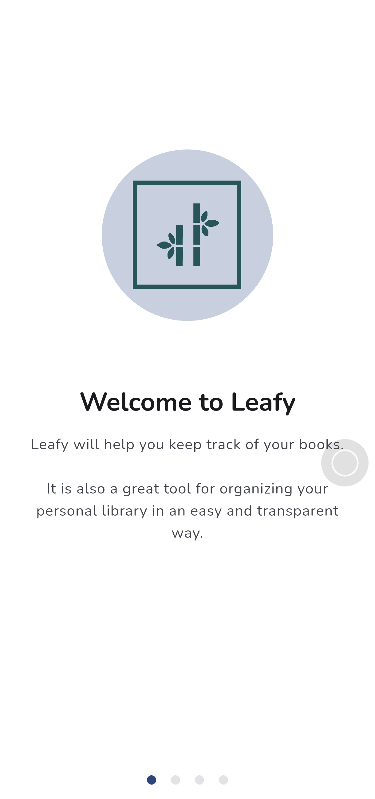
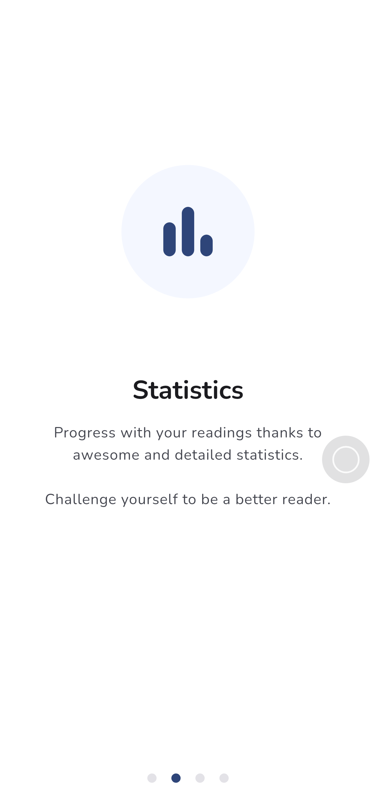
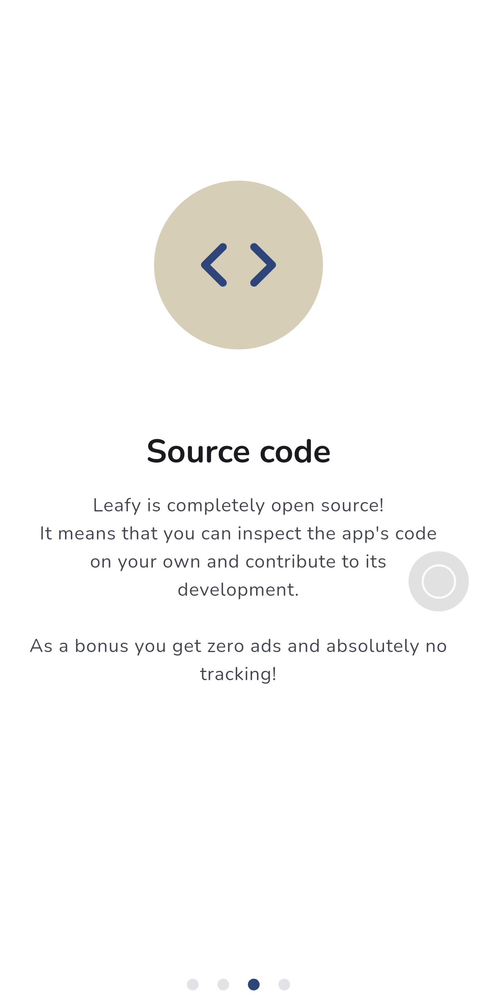
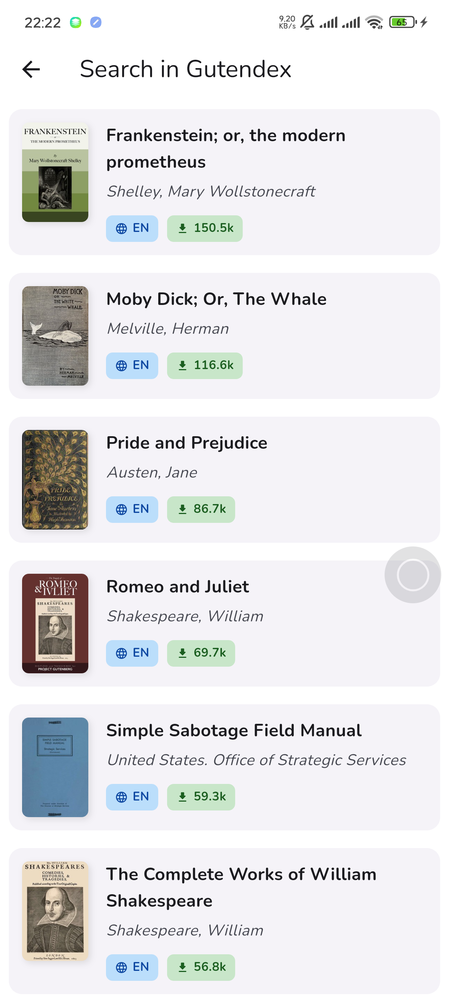
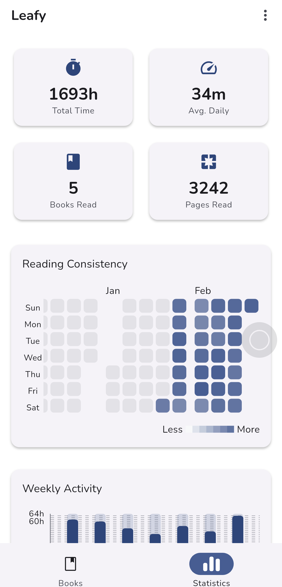
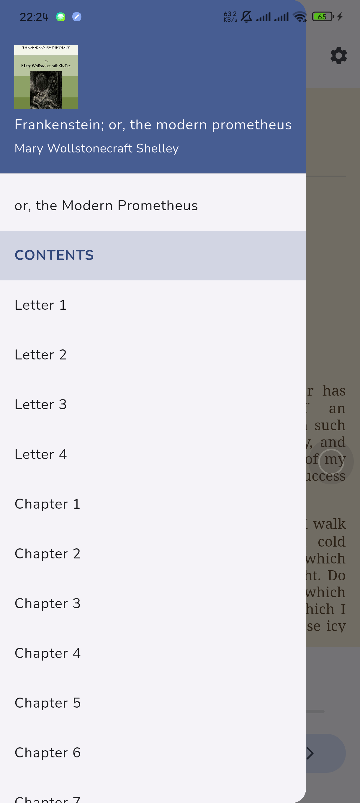
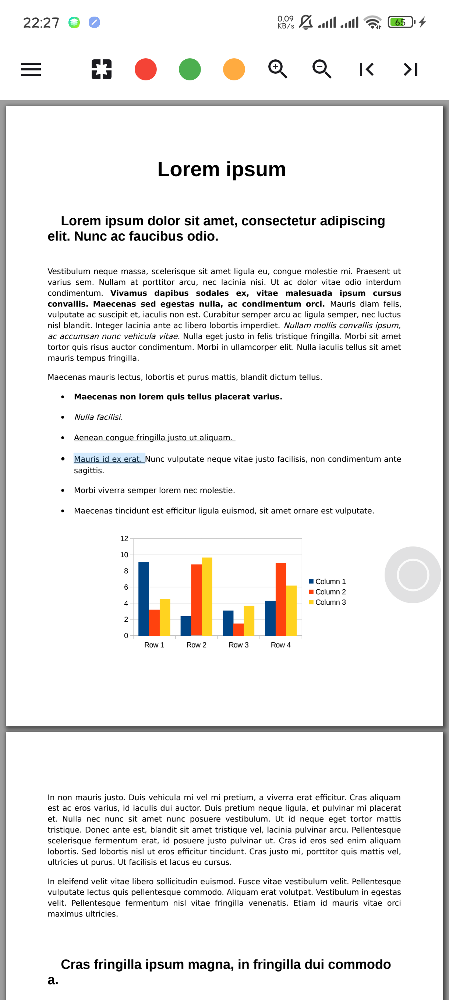

<!--
  Title: Leafy
  Description: A beautiful, privacy-focused book tracker and reader app built with Flutter.
  Author: nmheeir
  -->

# 🍃 Leafy

<p align='center'>
  
</p>

<p align='center'>
  <strong>Your personal book companion — Track, Read, and Discover.</strong>
</p>

<p align='center'>
  <a href="https://github.com/nmheeir/leafy/releases/latest">
    
  </a>
  <a href="https://github.com/nmheeir/leafy/blob/main/LICENSE">
    
  </a>
  <a href="https://github.com/nmheeir/leafy/issues">
    
  </a>
</p>

---

## ✨ About

**Leafy** is a privacy-oriented, open-source book tracker and reader application built with Flutter. It helps you organize your reading life, read EPUB & PDF files directly in-app, and gain insights into your reading habits — all without any account or cloud dependency required.

---

## 📚 Features

### 📖 Library Management

- **Four Reading Lists** — Organize books by status:
  - ✅ Finished
  - 📖 Currently Reading
  - 📋 Want to Read
  - ❌ Did Not Finish
- **Custom Tags** — Create, manage, and filter books using custom color-coded tags
- **Multiple Display Modes** — Switch between list and grid views
- **Sort & Filter** — Advanced sorting and filtering options for your library
- **Multi-Select Actions** — Bulk operations on multiple books at once
- **Trash & Restore** — Soft-delete with recovery support

### 🔍 Book Discovery

- **Open Library Search** — Look up books from the Open Library database
- **Gutendex Integration** — Browse and download free public domain books from Project Gutenberg
- **Manual Entry** — Add books with full details manually
- **Cover Search** — Find and download missing book covers

### 📕 Built-in Readers

- **EPUB Reader** — Full-featured EPUB reader with:
  - Customizable fonts, font sizes, and themes
  - Reading progress tracking
  - Bookmarks
  - Chapter outline navigation
  - Wakelock support (keep screen on while reading)
- **PDF Reader** — Integrated PDF viewer with:
  - Page thumbnails navigation
  - Full-text search within PDF
  - Outline/Table of contents
  - Password-protected PDF support
  - Multi-page layout options
- **File Import** — Import EPUB and PDF files from your device to attach to books

### 📊 Statistics & Insights

- **Reading Heatmap** — GitHub-style contribution heatmap showing your daily reading activity
- **Summary Grid** — Quick overview of total books, pages, and reading streaks
- **Genre Breakdown** — Visual chart of your reading genres distribution
- **Weekly Activity Chart** — Track your reading patterns throughout the week

### 🕐 Reading History & Sessions

- **Reading History** — View a chronological log of your reading sessions
- **Progress Tracking** — Track reading progress per book resource (EPUB/PDF)
- **Reading Sessions** — Automatic reading session logging with time tracking

### 🤖 AI-Powered Features

- **Gemini AI Integration** — Connect your own Gemini API key for:
  - Chapter translation (stream-based real-time translation)
  - Chapter summarization
  - Multi-model support (choose from available Gemini models)

### 🔔 Notifications

- **Daily Reading Reminders** — Configurable daily notifications to encourage reading habits
- **Custom Reminder Time** — Set your preferred reminder time

### 💾 Backup & Sync

- **Local Backup** — Create and restore full ZIP backups (database + covers)
- **Google Drive Backup** — Cloud backup/restore via Google Drive
- **CSV Export/Import** — Export your book library to CSV or import from CSV files
- **Backup Validation** — Verify backup integrity before restoring

### 🎨 Appearance & Customization

- **Material Design 3** — Modern UI following Material You guidelines
- **Dynamic Color** — System-based dynamic theming (Material You / Monet)
- **Theme Modes** — Light, Dark, and AMOLED Dark modes
- **Accent Color Picker** — Choose a custom accent color
- **Multiple Visual Themes** — Pre-built theme options
- **13+ Font Options** — Choose from fonts including Nunito, Inter, Poppins, Montserrat, Lora, Jost, and more
- **Rating Types** — Multiple rating display styles (stars, %, 10-point scale)

### 🌍 Localization

- **Multi-language Support** — Currently available in:
  - 🇺🇸 English
  - 🇻🇳 Tiếng Việt

### 🏗️ Architecture

- **Clean Architecture** — Domain-driven design with clear separation of concerns
- **BLoC Pattern** — State management using flutter_bloc + hydrated_bloc
- **Dependency Injection** — Injectable + GetIt for service location
- **Local Database** — SQLite via sqflite for offline-first data persistence

---

## 🖼️ Screenshots

### Welcome

<p align='left'>
  
  
  
</p>

### Discovery & Book Detail

<p align='left'>
  
  
  
</p>

### Built-in Readers

<p align='left'>
  
  
</p>

---

## 🏗️ Build Process

### Prerequisites

- [Flutter SDK](https://docs.flutter.dev/get-started/install) (≥ 3.10.0)
- Android SDK / Xcode (for mobile builds)

### Steps

1. **Clone the repository**

   ```sh
   git clone https://github.com/nmheeir/leafy.git
   cd leafy
   ```

2. **Install dependencies**

   ```sh
   flutter pub get
   ```

3. **Generate code** (freezed, json_serializable, injectable, etc.)

   ```sh
   dart run build_runner build --delete-conflicting-outputs
   ```

4. **Generate localization keys**

   ```sh
   melos run elgen
   ```

5. **Run the app**

   > ⚠️ If you already have a version of Leafy installed on your device, this step may replace it. Please make a backup first.

   ```sh
   flutter run
   ```

---

## 🤝 Contributing

We welcome contributions! Here's how you can help:

### 🌟 Star the Project

If you find Leafy useful, give it a ⭐ on [GitHub](https://github.com/nmheeir/leafy)!

### 🐞 Report Bugs or Suggest Features

Submit an issue here: [Leafy Issues](https://github.com/nmheeir/leafy/issues)

### 📝 Contributor's Guide

Please read our [CONTRIBUTING.md](CONTRIBUTING.md) before submitting pull requests.

### 🌍 Help Translate

Add or improve translations by editing the JSON files in `assets/translations/`.

---

## 📄 License

This project is licensed under the **MIT License** — see the [LICENSE](LICENSE) file for details.

---

## 🙏 Acknowledgements

- [Open Library](https://openlibrary.org/) — Book metadata and covers
- [Gutendex](https://gutendex.com/) — Free public domain ebooks API
- [Font Awesome](https://fontawesome.com/) — Icons
- [Material Symbols](https://fonts.google.com/icons) — Material Design icons
- Built with ❤️ using [Flutter](https://flutter.dev)
