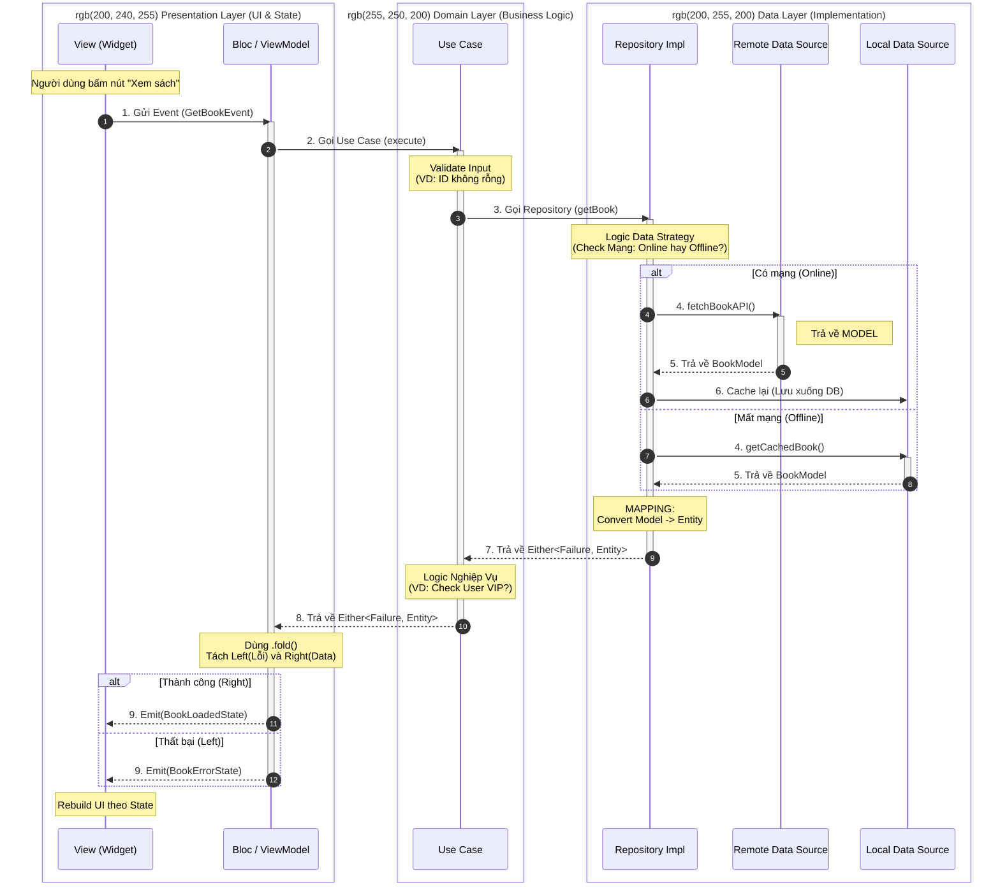

```mermaid
sequenceDiagram
    autonumber

    %% Phân chia các Layer
    box rgb(200, 240, 255) Presentation Layer (UI & State)
        participant UI as View (Widget)
        participant Bloc as Bloc / ViewModel
    end

    box rgb(255, 250, 200) Domain Layer (Business Logic)
        participant UC as Use Case
    end

    box rgb(200, 255, 200) Data Layer (Implementation)
        participant Repo as Repository Impl
        participant Remote as Remote Data Source
        participant Local as Local Data Source
    end

    %% Bắt đầu luồng
    Note over UI: Người dùng bấm nút "Xem sách"
    UI->>Bloc: 1. Gửi Event (GetBookEvent)
    activate Bloc

    Bloc->>UC: 2. Gọi Use Case (execute)
    activate UC

    Note over UC: Validate Input<br/>(VD: ID không rỗng)

    UC->>Repo: 3. Gọi Repository (getBook)
    activate Repo

    Note over Repo: Logic Data Strategy<br/>(Check Mạng: Online hay Offline?)

    alt Có mạng (Online)
        Repo->>Remote: 4. fetchBookAPI()
        activate Remote
        Note right of Remote: Trả về MODEL
        Remote-->>Repo: 5. Trả về BookModel
        deactivate Remote
        Repo->>Local: 6. Cache lại (Lưu xuống DB)
    else Mất mạng (Offline)
        Repo->>Local: 4. getCachedBook()
        activate Local
        Local-->>Repo: 5. Trả về BookModel
        deactivate Local
    end

    Note over Repo: MAPPING:<br/>Convert Model -> Entity

    Repo-->>UC: 7. Trả về Either<Failure, Entity>
    deactivate Repo

    Note over UC: Logic Nghiệp Vụ<br/>(VD: Check User VIP?)

    UC-->>Bloc: 8. Trả về Either<Failure, Entity>
    deactivate UC

    Note over Bloc: Dùng .fold()<br/>Tách Left(Lỗi) và Right(Data)

    alt Thành công (Right)
        Bloc-->>UI: 9. Emit(BookLoadedState)
    else Thất bại (Left)
        Bloc-->>UI: 9. Emit(BookErrorState)
    end
    deactivate Bloc

    Note over UI: Rebuild UI theo State
```
